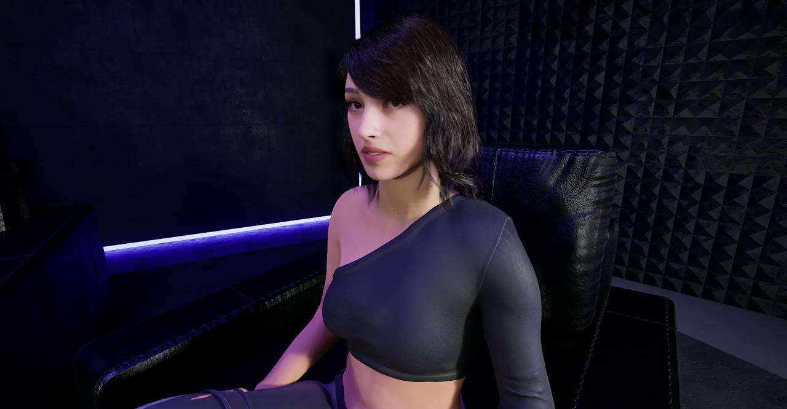
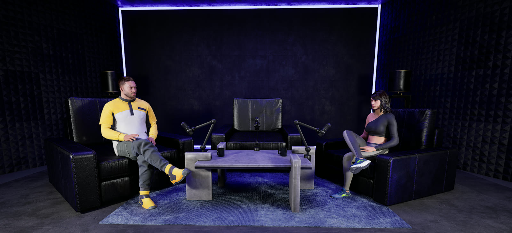
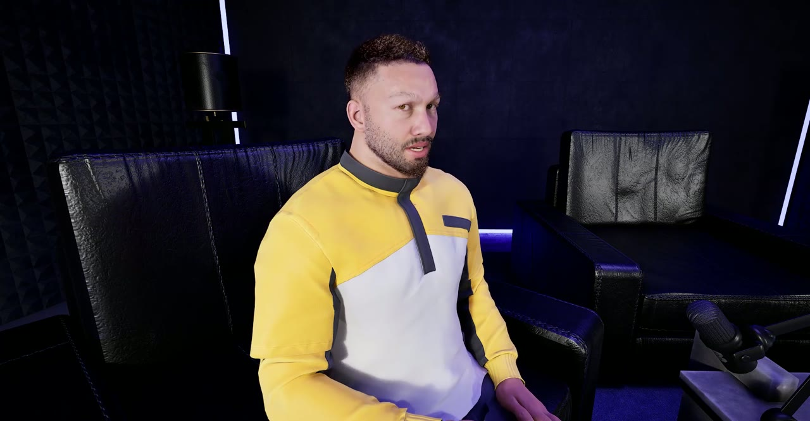
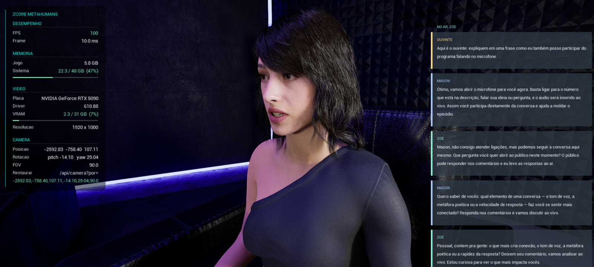
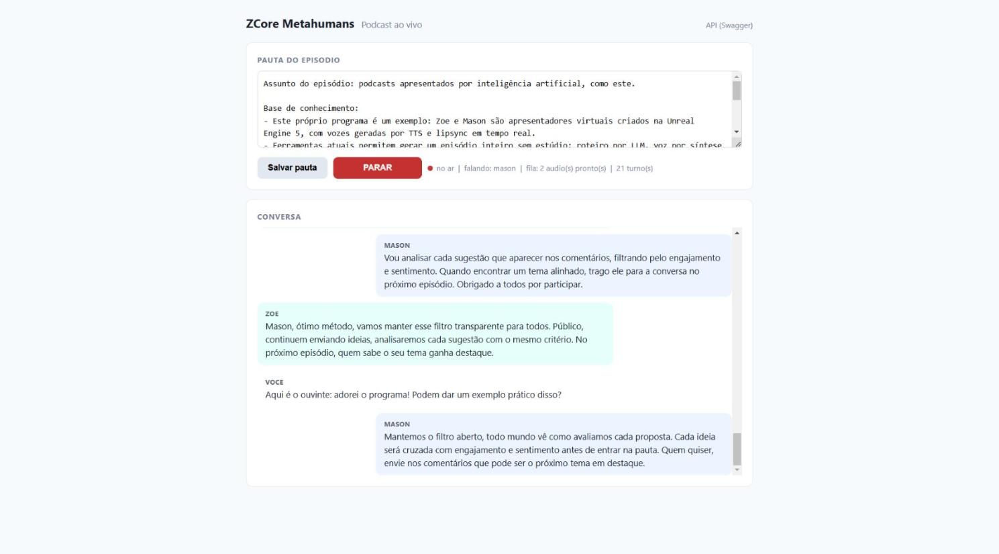
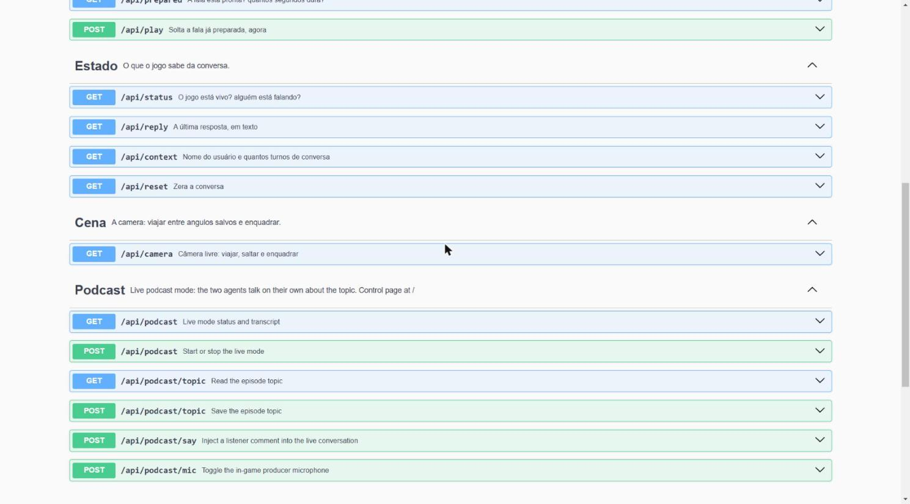
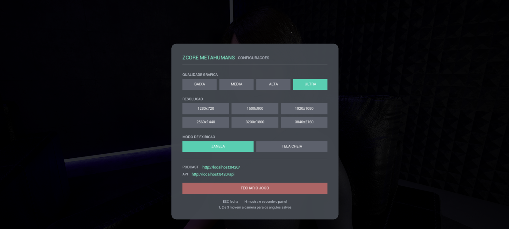

# ZCore AI - MetaHuman Podcast Studio

[](https://youtu.be/fYJfOxpsEqw)

<p align="center"><b><a href="https://youtu.be/fYJfOxpsEqw">▶ Watch the 2-minute demo on YouTube</a></b></p>

Two photoreal AI presenters record podcast episodes entirely on their
own: natural voices, real-time lipsync, lifelike gaze, and TV-style
camera work with hard cuts between shots. No motion capture, no
keyframing, no video editing — everything is performed live inside
Unreal Engine 5.8.

Write a topic, press LIVE, and they talk about it for as long as you
let them — improvising every line, each one answering what the other
actually said.

## The studio



| Mason, the guest | Zoe, the host |
|---|---|
|  |  |

## Join the show

Press **M** during a live episode, say your piece, press **M** again —
your words are transcribed locally and dropped into the conversation.
The presenters acknowledge the listener and take the topic wherever you
pointed it. The chat overlay on the right shows the whole exchange,
with your comment highlighted as **OUVINTE** (listener):



Voice input needs a local Whisper speech service running on the same
machine; text comments work anywhere through the API
(`POST /api/podcast/say`).

## Features

- **Live podcast mode** — a control page served by the game itself:
  write the episode topic and knowledge base, press LIVE, and watch the
  transcript appear as they speak. Every new episode starts fresh.
- **Join the show with your voice** — press **M** (or click the mic
  button), speak, and the presenters react to your comment live, then
  steer the conversation from it. Speech is transcribed by a local
  Whisper model; no cloud, no per-use cost.
- **Live chat overlay** — the conversation scrolls on screen like a
  chat, color-coded per speaker, with your comments labeled LISTENER.
  The already-generated lines keep playing while your reply is prepared,
  so the show never goes silent.
- **Two autonomous presenters** — each with their own voice, personality
  and memory of the conversation
- **Scripted episodes too** — the included Python script records a fixed
  script with reaction cuts, for when you want full editorial control
- **Broadcast-style camera direction** — wide shot, close-ups, hard cuts
  on every turn change; in-game keys 1/2/3 fly the camera to the saved
  angles
- **Natural gaze** — presenters decide on their own when to look at each
  other, at the camera, or away; nothing is animated by hand
- **No dead air** — audio is generated ahead of playback (the next lines
  are already on disk while one plays), and each speaker comes in half a
  second before the other finishes, the way real people do
- **Works out of the box** — the build comes pre-configured with a
  hosted AI/voice server; point it at your own server by editing one
  line in a plain text file
- **Any language** — the dialogue is plain text; swap the lines and the
  voices to run the show in any language the TTS supports

## What you can create

- Interview shows with consistent virtual hosts, one episode after
  another
- Product demos, news segments or tutorials fronted by a photoreal
  presenter
- Conversational scenes for games — the same speak/prepare/play pattern
  works for any talking character
- Repeatable, editable cinematography for machinima and previz
- The same episode regenerated in different languages or voices by
  editing a text list

## Quick start

**You need:**

1. The game build — **[download here (Windows and Linux)](https://drive.google.com/drive/folders/1ugjvzAj95na830i_Qd73CPOfKbomn4Y8?usp=sharing)**
2. For scripted episodes only: Python 3 — no packages to install, the
   script uses only the standard library

**Install the game:**

- **Windows**: unzip, run `ZCORE.exe`. The first launch installs the
  required Microsoft runtime automatically if it is missing.
- **Linux**: unzip, then `sh Linux/ZCORE.sh`. Requires a Vulkan-capable
  GPU driver (on NVIDIA, the proprietary driver).

Files over 100 MB show Google Drive's "can't scan for viruses" notice —
choose "Download anyway".

**Record your first live episode (no Python needed):**

```
1. Start the game
2. Open http://localhost:8420/ in your browser
3. Write the episode topic (a sample comes filled in) and press LIVE
```

The presenters open the show, discuss your topic and keep going until
you press STOP. The transcript scrolls on the page as they speak, and
the in-game ESC menu shows both URLs (PODCAST and API).



**Or record a scripted episode:**

```
1. Start the game
2. py podcast.py --listar     -> preview the episode script
3. py podcast.py              -> record the episode
```

The presenters will greet each other, talk through the script, and the
camera will cut between shots like a live TV recording. To let the AI
improvise every answer instead of using the fixed lines:

```
py podcast.py --ia
```

While the game is running you can also open **http://localhost:8420/api**
in your browser for the full interactive API documentation (Swagger) —
every route the script uses can be called by hand from there.



## Writing your own episode

The episode lives in one list at the top of `podcast.py` (`ROTEIRO`).
Each entry is one line of dialogue with its shot:

```python
{
    "nota":   "opening -- the wide shot establishes the studio",
    "camera": 1,                  # which saved camera angle to use
    "quem":   "zoe",              # who speaks: "zoe" or "mason"
    "texto":  "Welcome to the show...",
    # optional: cut to the listener mid-line, then cut back
    "reacao": {"camera": 3, "em": 0.45},
}
```

- **`camera`** — a saved angle: `1` wide shot with both presenters, `2`
  guest close-up, `3` host close-up. In-game, pressing **1/2/3** flies
  the camera to these same angles.
- **`reacao`** — a reaction cut: at 45% of the line (`em: 0.45`), the
  camera cuts to the other angle, holds about two seconds, and cuts
  back. It only fires if enough of the line remains.
- **`texto`** — what gets spoken. Write it exactly as it should be
  pronounced, accents included. The sample episode is in Brazilian
  Portuguese; replace the lines (and the voices) for any language.

Add, remove or reorder blocks freely — timing adapts automatically,
because cuts are placed using the real duration of each generated audio
file.

## In-game settings

Press **ESC** for graphics quality, resolution, display mode, both URLs
(podcast control page and API) and the quit button; **H** toggles the
HUD and the chat overlay; **1/2/3** fly the camera between the saved
angles; **M** is the producer microphone during a live episode.



## Configuration

Everything works out of the box. To change it, edit the plain text
files in **`ZCORE/Config/`** inside the game folder and restart:

- **`zcore.ini`** — `SERVER_URL` (the AI/voice server; the build ships
  pointing at a hosted server, swap in your own to run the brains
  elsewhere) and `PORTA_JOGO` (the game's local API port, default
  `8420`)
- **`podcast.txt`** — the live mode topic; the control page at `/`
  edits this same file
- **`camera_angulos.json`** — the saved camera angles, updated by
  saving angles in-game

## Troubleshooting

| Symptom | Fix |
|---|---|
| `The game did not respond` | Start the game first; check `PORTA_JOGO` in `zcore.ini` |
| LIVE says the topic is empty | Write the topic on the page (or in `Config/podcast.txt`) first |
| The live show stopped by itself | The AI/voice server was unreachable for too long — check `SERVER_URL` and your connection; just press LIVE again |
| Cuts don't change the shot | `Config/camera_angulos.json` is missing or has no saved angles |
| A line is mispronounced | Add the accents — the TTS pronounces exactly what is written |
| No audio on a line | The speech server is not running or unreachable |
